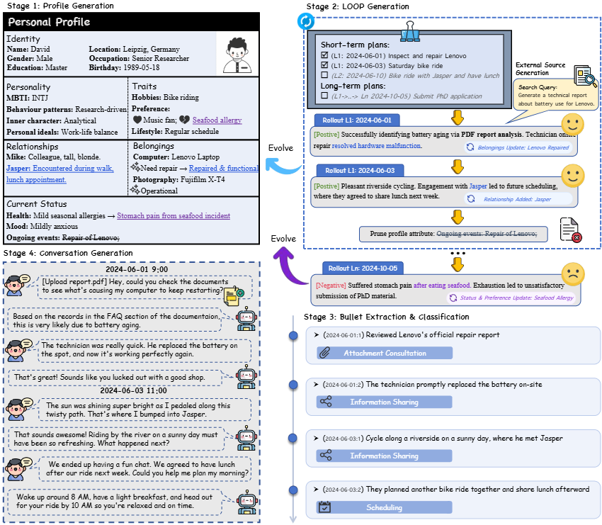

# RHELM: Beyond Static Dialogues

**Beyond Static Dialogues: Benchmarking Realistic, Heterogeneous, and Evolving Long-Horizon Memory**

[](https://arxiv.org/pdf/2605.31086)
[](https://microsoft.github.io/RHELM/)
[](https://huggingface.co/datasets/hanzhang-lang/RHELM-Benchmark)
[](https://github.com/microsoft/RHELM)
<!-- [](LICENSE)
[](https://www.python.org/downloads/) -->

<p align="center">
  
</p>

## 📖 Overview

RHELM is a comprehensive benchmark for evaluating long-horizon memory capabilities in AI systems. Unlike existing benchmarks that focus on static dialogues, RHELM introduces **realistic**, **heterogeneous**, and **evolving** memory challenges that better reflect real-world assistant scenarios.

### Key Features

- 🎭 **Realistic Profiles**: Diverse characters with rich backstories, preferences, and evolving life circumstances
- 📊 **Heterogeneous Data**: Multi-modal external memory sources including conversations, emails, documents
- 🔄 **Temporal Evolution**: Time-aware questions that test memory across different temporal contexts
- 🧠 **Challenging Question Taxonomy**: 7 major categories with 26 complex characteristics requiring multi-hop reasoning, temporal synthesis, preference tracking, and hallucination detection
- ⚠️ **Memory-Conditioned Misleading Queries**: "Trap" queries that conflict with the user's updated life state, requiring the assistant to detect the implicit conflict, decline the unsafe request, and propose a constraint-compliant alternative
<!-- - 🎯 **Advanced Reasoning Requirements**: Questions designed to test entity disambiguation, causal reasoning, anomaly detection, and cross-document inference -->

## 📋 Challenge Taxonomy

RHELM features a comprehensive taxonomy of challenging memory questions across three major QA domains with **7 categories** and **26 complex characteristics**.

👉 **[View Full Challenge Taxonomy](docs/CHALLENGE_TAXONOMY.md)**


## 🗂️ QA Format

Each QA file is in
JSONL format

```json
{
  "id": "fact_19130b",
  "question": "Reflecting on the morning when my routine felt particularly unsettled and I ended up with a less-than-ideal start, what did I actually have for my first meal of the day?",
  "answer": "Leftover lentil soup",
  "question_date": "2024-10-28",
  "question_type": "fact",
  "supporting_evidence": ["2024-05-26:5"],
  "characteristics": ["State-Dependent Attribute"]
}
```

| Field | Type | Description |
|-------|------|-------------|
| `id` | string | Unique question identifier, prefixed by its question type (e.g. `fact_19130b`). |
| `question` | string | The user query posed to the memory system. |
| `answer` | string | The ground-truth answer used for evaluation. |
| `question_date` | string (`YYYY-MM-DD`) | The date from which the question is asked. To better utilize the benchmark complexity, it is recommended to use all history evidence.|
| `question_type` | string | One of: `fact`, `temporal`, `hallucination`, `aggregation`, `misleading`, `attachment`, `mixed`. |
| `supporting_evidence` | list[string] | References to source items that ground the answer. Conversation evidence uses the form `"<session-date>:<turn-index>"` (e.g. `"2024-05-26:5"` = turn 5 of the 2024-05-26 session); attachment evidence references the file/section (e.g. `"56_report_task_*.md:Section"`). |
| `characteristics` | list[string] | Fine-grained challenge labels for the question (e.g. `State-Dependent Attribute`, `Multi-Hop Traversal`). See the [Challenge Taxonomy](docs/CHALLENGE_TAXONOMY.md). |


## 🚀 Quick Start

### Installation

```bash

# Create virtual environment (recommended)
python -m venv venv
source venv/bin/activate  # On Windows: venv\Scripts\activate

# Install dependencies
pip install -r requirements.txt
```

### Running Evaluation

The evaluation reads its dataset from the `data/` directory (conversations, emails,
attachments) and a QA file in JSONL format. Provide the QA file via `--input-file`:

```bash
# Basic RAG evaluation (dense retrieval, top-k=5)
python -m evaluation.rag_benchmark \
    --character "David_R._Ellis" \
    --input-file "data/QA_final/low_score_qa_David_R._Ellis_all_validated.jsonl"

# Full-context evaluation (no retrieval, feed all evidence to the model)
python -m evaluation.rag_benchmark \
    --character "David_R._Ellis" \
    --input-file "data/QA_final/low_score_qa_David_R._Ellis_all_validated.jsonl" \
    --full-context

# RAG evaluation including emails and attachments, with hybrid (BM25 + dense) retrieval
python -m evaluation.rag_benchmark \
    --character "David_R._Ellis" \
    --input-file "data/QA_final/low_score_qa_David_R._Ellis_all_validated.jsonl" \
    --include-attachment \
    --hybrid \
    --k 10
```

### Configuration

LLM credentials are read from environment variables (never hard-coded):

```bash
# OpenAI
export OPENAI_API_KEY="sk-..."

# or Azure OpenAI
export AZURE_OPENAI_ENDPOINT="https://<resource>.openai.azure.com/"
export AZURE_OPENAI_API_KEY="..."
```

Dataset locations, embedding model, chunking and output paths can be customised in
[evaluation/configs/config.py](evaluation/configs/config.py).

## 📦 Data & Code Release

| Component | Status |
|-----------|--------|
| Evaluation Framework | ✅ Available |
| Benchmark Data | [🤗 HuggingFace](https://huggingface.co/datasets/hanzhang-lang/RHELM-Benchmark) |
| Data Generation Code | 🔜 To be released |


---

**Note**: Data generation pipeline will be released upon paper acceptance