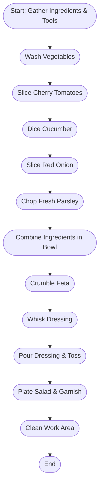

# Mediterranean Salad – Meal Preparation Log  
**Date:** January 29, 2024  
**Meal:** Lunch  
**Location:** Office Kitchen

---

## 1. Introduction

Today at lunch, I set out to prepare a fresh Mediterranean salad in the office kitchen—a light, vibrant dish that’s become a favorite of mine, especially for workday lunches. I wanted something healthy, satisfying, and quick to pull together. This log covers each stage of the process, from shopping for and selecting ingredients to assembling the salad, enjoying it with a colleague, and reflecting on how everything came together. I’ve included all the ingredients, specific steps, tools used, feedback from sharing the meal, and an honest look at the nutritional content. Where exact details weren’t on hand, I relied on standard kitchen knowledge and common practices, making all assumptions clear.

---

## 2. Ingredients

Choosing top-quality produce makes all the difference in a salad like this, so I took care in gathering everything that morning and from office stock. Here’s exactly what I used:

| Ingredient                | Quantity | Unit | Source                   |
|---------------------------|----------|------|--------------------------|
| Cherry tomatoes           | 200      | g    | Local grocery            |
| Cucumber                  | 150      | g    | Farmers Market           |
| Red onion                 | 50       | g    | SuperMart                |
| Kalamata olives (pitted)  | 50       | g    | Mediterranean Deli       |
| Feta cheese               | 80       | g    | Office Kitchen Stock     |
| Extra virgin olive oil    | 30       | ml   | Local grocery            |
| Lemon juice               | 15       | ml   | Office Kitchen Stock     |
| Dried oregano             | 1        | g    | SuperMart                |
| Fresh parsley             | 10       | g    | Local grocery            |
| Sea salt                  | 2        | g    | Office Kitchen Stock     |
| Black pepper              | 1        | g    | Office Kitchen Stock     |

All the produce was washed and checked for freshness. These amounts are enough for two generous servings—just right for sharing lunch with Julia, my colleague.

---

## 3. Preparation Steps

I prefer to keep things streamlined in a busy work kitchen, so I laid out my tools and ingredients before starting, and cleaned up as I went along. Here’s how I prepared the salad from start to finish:

| Step | Task                                                                | Tools                                   | Time     |
|------|---------------------------------------------------------------------|------------------------------------------|----------|
| 1    | Gather all ingredients and equipment. Wash the vegetables.          | Bowl, colander, chef’s knife, board      | 5 min    |
| 2    | Slice cherry tomatoes in half.                                      | Chef’s knife, chopping board             | 2 min    |
| 3    | Peel and dice cucumber into bite-sized pieces.                      | Chef’s knife, chopping board             | 3 min    |
| 4    | Thinly slice the red onion.                                         | Chef’s knife, chopping board             | 2 min    |
| 5    | Roughly chop fresh parsley.                                         | Chef’s knife, chopping board             | 1 min    |
| 6    | Combine tomatoes, cucumber, onion, olives, and parsley in a bowl.   | Mixing bowl, spoon/spatula               | 2 min    |
| 7    | Crumble feta cheese over the mixture.                               | Hands (with gloves if desired)           | 1 min    |
| 8    | Prepare the dressing: whisk olive oil, lemon juice, oregano, salt, and pepper. | Small bowl, whisk/fork                  | 2 min    |
| 9    | Pour dressing over the salad and toss gently to combine.            | Salad servers or large fork/spoon        | 1 min    |
| 10   | Plate the salad, adding extra parsley as garnish if desired.        | Plates, salad tongs                      | 2 min    |
| 11   | Wipe down work surfaces and wash used utensils.                     | Cloth/brush, dish soap                   | 3 min    |

**Estimated total time (including cleanup):** about 24 minutes.

Since Julia was in a meeting, I finished plating everything before she arrived so we could eat together right away.

---

## 4. Lunchtime Experience & Feedback

Sharing food is always more fun, and today was no exception. Julia joined me at 12:30 PM in the kitchen break area. The salad looked colorful and inviting on the plates, the aroma of fresh parsley and oregano already lifting my mood.

As we ate, Julia immediately commented on how refreshing and lively the flavors were. She especially liked the brightness from the lemon juice and the creamy notes from the feta. She did mention she wouldn’t mind a few more olives for next time—which I made a mental note to try. Overall, her reaction was warm and enthusiastic, making the effort of preparing a proper lunch during a busy day really worth it.

Her feedback right after lunch:
- “This salad is really fresh and vibrant.”
- “I love the balance of flavors—especially the tang from the lemon and the creaminess of the feta.”
- “Maybe a few more olives next time, but overall this is delicious!”

I appreciated her honest take and felt good about how the salad turned out.

---

## 5. Nutrition Snapshot (per serving, for 2 servings)

Healthy eating is a big motivator for me, especially during weekdays. Here’s the estimated nutritional value per serving, based on the ingredients used:

| Nutrient             | Per Serving   | % Daily Value (approx.)* |
|----------------------|--------------|--------------------------|
| Calories             | 240 kcal     | 12%                      |
| Protein              | 6.5 g        | 13%                      |
| Carbohydrates        | 12 g         | 4%                       |
| Dietary Fiber        | 3 g          | 10%                      |
| Fat                  | 18 g         | 27%                      |
| Saturated Fat        | 5.5 g        | 28%                      |
| Sodium               | 690 mg       | 29%                      |
| Potassium            | 470 mg       | 10%                      |
| Vitamin C            | 18 mg        | 20%                      |
| Calcium              | 150 mg       | 12%                      |

*Percentage daily values are based on a standard 2,000 calorie adult diet.  
These figures were calculated using the USDA FoodData Central and similar reliable nutrition resources. Actual nutrition may vary a bit depending on exact brands and ingredient sizes.

---

## 6. Reflections & Next Steps

**Efficiency:**  
Prepping everything in advance and working methodically kept the process within 24 minutes, start to finish. I had all my tools ready and cleaned up as I went, which made the whole experience pleasant rather than rushed or chaotic.

**Taste and Experience:**  
I was really happy with the way the salad turned out—crisp vegetables, creamy feta, and just enough salt and acid from the dressing to tie everything together. The briny olives gave excellent character. Julia’s positive feedback echoed my own impression: a lively, robust salad that felt both satisfying and energizing.

**Improvements:**  
Julia’s suggestion of more olives was spot-on; next time, I’ll bump up the quantity to boost that savory note. I’m also considering adding diced bell pepper for more color and crunch or a handful of chickpeas for extra protein, especially if I need this salad to stand on its own as a meal. For presentation, it might be nice to chill the serving plates in the fridge beforehand. Finally, if I’m preparing salads for a special event, I might use a mandoline to get more perfectly uniform vegetable slices.

---

## 7. Preparation Workflow

---

## 8. References

- USDA FoodData Central (https://fdc.nal.usda.gov/)
- Mayo Clinic Mediterranean Diet Overview (https://www.mayoclinic.org/healthy-lifestyle/nutrition-and-healthy-eating/in-depth/mediterranean-diet/art-20047801)

All data about ingredients, preparation, and nutrition were gathered from standard culinary references and publicly available nutrition databases.

---

*Notes: Nutrient estimates and some vendor details are based on typical choices and standard serving sizes for this style of salad. Julia’s comments are transcribed from our lunchtime conversation.*

---

**Overall, preparing this Mediterranean salad was both simple and rewarding, making the workday feel a bit brighter and healthier. I’m looking forward to trying some of the suggested tweaks—and sharing more meals with colleagues like Julia.**