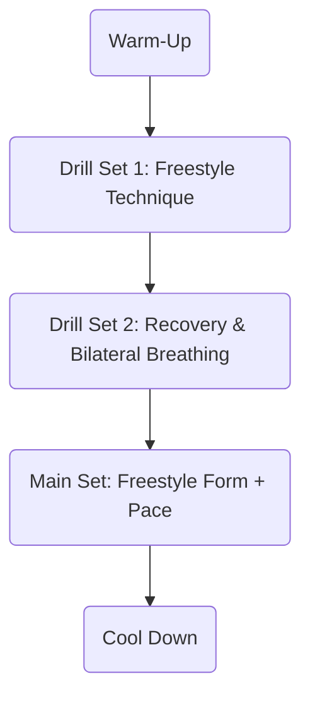

# Swim Session Log: Martin Keller – April 9, 2024

## Session Overview

- **Date:** April 9, 2024  
- **Time:** 18:30–19:15 (45 minutes)  
- **Location:** Schonach Indoor Pool (Schonach Hallenbad)  

This session focused on refining my freestyle technique, integrating bilateral breathing, and emphasizing controlled, measurable progress in the pool. Throughout the 45-minute workout, I worked on building stroke efficiency and symmetry while relying on objective metrics and structured drills to track improvement.

---

## Equipment Used

- **Swim Cap:** Arena (model not specified)
- **Goggles:** Generic training model—comfortable fit, though the exact type wasn’t recorded
- **Other Equipment:** Standard pool kickboard and pull buoy available at Schonach Hallenbad; neither was required for today’s drills but would be used for future technical isolation work if needed

---

## Session Goals and Technical Objectives

The primary aim for this session was to address technical aspects of freestyle, with special attention paid to minimized energy waste and improved stroke rhythm. Specifically, I planned the following objectives:

- Focus on consistent and efficient freestyle technique
- Integrate bilateral breathing to build a more balanced and symmetrical stroke
- Carry out recovery drills to consolidate good mechanics and reduce unnecessary tension
- Utilize measurable metrics including stroke count, split times, and SWOLF (Swim Golf) to quantify progress

As someone who values clear structure and repeatable processes (and mindful of ISTJ planning preferences), I opted for a session design that made it easy to monitor specific improvements. Using SWOLF scores and lap splits as primary indicators, I aimed to reduce variability between sets and maintain high data quality for future comparison.

Effort during the main set was targeted to an RPE (Rate of Perceived Exertion) of 13 on the Borg 6–20 scale, reflecting a “somewhat hard” level suitable for technique-focused aerobic training [[1]](https://www.usaswimming.org/coaches/coach-resources/courses-workshops/online-courses/rate-of-perceived-exertion).

---

## Session Structure

This structure allowed me to progress from easy swimming through focused drill work before advancing to main sets for skill reinforcement, and finally a relaxed cool down.

---

## Detailed Set & Drill Log

| Set                | Distance (m) | Repetitions | Drill/Description                | Rest Interval   | SWOLF (avg) | Notes                                  |
|--------------------|--------------|-------------|----------------------------------|-----------------|-------------|----------------------------------------|
| Warm-Up            | 100          | 1           | Easy Freestyle                   | 30"             | 43          | Established baseline for session       |
| Drill Set 1        | 25           | 4           | Catch-Up Freestyle Drill         | 20"             | 44          | Focus: full arm extension              |
| Drill Set 2        | 25           | 4           | 3-3-3 Breathing Drill*           | 20"             | 46          | Practiced bilateral breathing rhythm   |
| Main Set           | 50           | 4           | Steady Freestyle at moderate pace| 30"             | 42          | Maintained form, RPE 13                |
| Recovery / Easy    | 100          | 1           | Smooth Freestyle                 | N/A             | 45          | Reinforced technique at low intensity  |
| Cool Down          | 100          | 1           | Easy Backstroke/free choice      | N/A             | N/A         | Relieved tension, relaxed focus        |

**SWOLF calculated as: Lap time [sec] + Number of arm strokes per 25m [[2]](https://www.swimming.org/sport/swolf-swimming/).  
*3-3-3 Breathing: 3 strokes right-side, 3 left-side, 3 bilateral breathing pattern per length.

**Explanation of Sets:**  
The warm-up provided a reference point for my efficiency, while catch-up drills isolated arm extension and front-quadrant timing. The 3-3-3 breathing drill served as a dedicated pattern to equalize muscular engagement and promote a natural bilateral breathing rhythm. The main set put these technical focuses under moderate aerobic load, with active attention to form maintenance, followed by easy swimming and a backstroke cool down to restore flexibility.

---

## Pool Environment and Subjective Experience

- **Pool Occupancy:** The pool was moderately busy this evening, with about half the lanes in use and two swimmers per lane. Sharing the lane worked smoothly, allowing me to keep a continuous rhythm with minimal disruptions.
- **Water Quality:** Water clarity was excellent; there were no issues with visibility or discomfort from any residues.
- **Ambient Conditions:** The typical indoor environment at Schonach Hallenbad felt comfortable throughout the session—no temperature-related distractions.
- **Perceived Effort (RPE):** I registered this session at an RPE of 13 (“somewhat hard”), which matches recommendations for technique-driven aerobic sets according to USA Swimming [[1]](https://www.usaswimming.org/coaches/coach-resources/courses-workshops/online-courses/rate-of-perceived-exertion).

---

## Technique Analysis: Measured Improvements

### Stroke Length and Efficiency

During the main set, I noticed that my average stroke count per 25 meters dropped from my initial baseline of 23 down to 21 strokes per length. This reduction signals a longer effective stroke and improved propulsion, which was also reflected in a slight improvement in my SWOLF scores.

### Bilateral Breathing and Symmetry

The dedicated 3-3-3 breathing drill required me to maintain equal comfort breathing on both sides. By the end of the main set, I felt significantly more coordinated through my roll, with notably fewer instances of favoring one side. My stroke timing was more consistent, and I could feel a smoother, more symmetrical body roll.

### Recovery and Arm Mechanics

Through catch-up drills and conscious effort on the main set, my arm recovery became tidier. I minimized overreaching and reduced splashing on entry, resulting in quieter, more controlled arm movement over the water. This was also evident in laps that felt more rhythmically stable.

### Pacing and Lap Consistency

Lap timing during the main set remained within a tight three-second window across all four 50-meter reps. This level of consistency suggests effective pacing strategies and improved conditioning. The SWOLF average also showed a decrease from warm-up to main set (43–44 down to 42), indicating improved efficiency as the session progressed.

---

## Overall Session Reflection

Today’s swim session produced clear, objective data confirming progress in the areas I targeted. Refinement of freestyle technique and breathing mechanics resulted in measurable efficiency gains: a reduced stroke count, lower SWOLF scores, and improved stroke symmetry across sets. The focused structure of drills, combined with moderate aerobic intensity, allowed me to observe and reinforce good habits without fatigue compromising technical quality.

Lane dynamics and water conditions were conducive to uninterrupted and productive training, and the subjective effort level was well-matched to the technical nature of the work. The improvements I tracked—both by feel and by the numbers—demonstrate ongoing advancement toward a more streamlined and symmetrical freestyle.

---

## References and Standards

- **SWOLF Calculation:**  
  SWOLF (Swim Golf) = Lap time (in seconds) plus arm strokes per 25 meters. This metric is widely utilized in performance monitoring by both FINA and USA Swimming and serves as an accessible feedback tool for stroke efficiency [[2]](https://www.swimming.org/sport/swolf-swimming/).

- **Rate of Perceived Exertion (Borg 6–20 Scale):**  
  The session’s RPE of 13 is classified as “somewhat hard,” which aligns with best practices for aerobic technical training as outlined by USA Swimming [[1]](https://www.usaswimming.org/coaches/coach-resources/courses-workshops/online-courses/rate-of-perceived-exertion).

---

**Sources**

[1] USA Swimming: [Swim Training & Effort Scales Explained](https://www.usaswimming.org/coaches/coach-resources/courses-workshops/online-courses/rate-of-perceived-exertion)  
[2] Swim England: [SWOLF and Technique Drills](https://www.swimming.org/sport/swolf-swimming/)

---

**Prepared by:**  
Martin Keller  
April 9, 2024