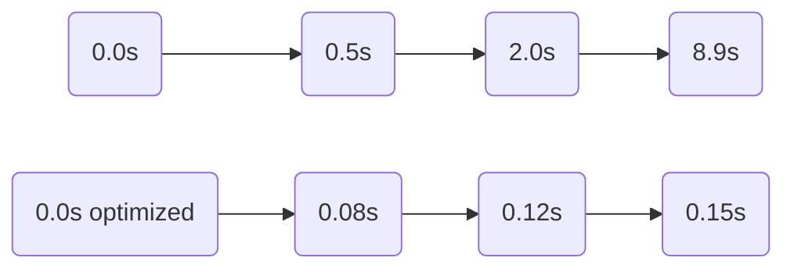

# Persistent MQTT Message Delay in Home Automation Dashboard on Dell XPS 15: Comprehensive Troubleshooting and Resolution

## System Overview

### Hardware

This troubleshooting investigation was conducted on a Dell XPS 15 (Model 9500), equipped with a 10th Gen Intel i7 processor, 32GB RAM, and a 1TB NVMe SSD. The device features both an integrated Intel WiFi 6 AX201 interface and a Realtek PCIe Gigabit Ethernet adapter, providing both wired and wireless network connectivity.

### Operating Systems

Testing was performed in a dual-boot environment, alternating between Windows 11 Pro (version 22H2) and Ubuntu 22.04 LTS (Kernel 5.15.x), managed via GRUB. Both operating systems were up to date as of May 1, 2024, with the latest drivers and all security patches applied. This dual-OS approach ensured that the observed behavior was not tied to a single operating system.

### Network Infrastructure

The home office network uses a TP-Link Archer AX6000 router supporting both wired (Cat6 Ethernet, 1Gbps) and wireless (dual-band WiFi 6, 802.11ax) connections. The XPS 15 was assigned a static DHCP lease, maintaining consistent network identity across tests. Other connected devices include a variety of smart home switches, bulbs, and environmental sensors communicating via Zigbee and Z-Wave protocols (through USB dongles). A dedicated Home Assistant server runs on a Raspberry Pi 4 Model B (RPi 4), acting as the home automation hub.

### MQTT Stack and Home Automation Protocols

The MQTT infrastructure centered on Eclipse Mosquitto v2.0.18, deployed locally on the XPS 15 and, for comparative tests, externally on the Raspberry Pi and the router. MQTT clients included the Eclipse Paho Python library (v3.10), Node-RED v3.1, and Home Assistant’s native MQTT integration. For device communication, Zigbee2MQTT (Zigbee support) and OpenZWave (Z-Wave support) were integrated with Home Assistant’s automation engine.

#### System Architecture Overview

```mermaid
graph LR
    XPS15[Dell XPS 15 (Windows/Linux) ]
    Broker[ Mosquitto Broker ]
    WiFi[WiFi AP (AX6000)]
    HA[Home Assistant (RPi)]
    ZigbeeDongle[Zigbee USB Dongle]
    ZWaveDongle[Z-Wave USB Dongle]
    IoTDevices[Zigbee/Z-Wave Devices]
    XPS15 -- Paho Client --> Broker
    XPS15 -- Mosquitto Broker ---|loopback| XPS15
    Broker -- MQTT/TCP --> WiFi
    WiFi -- Ethernet/WiFi --> HA
    HA -- Zigbee/Z-Wave --> IoTDevices
    HA -- MQTT client --> Broker
```

This arrangement replicates a typical smart home automation environment, emphasizing a local, low-latency topology ideal for real-time feedback and control.

---

## Problem Description

### Symptoms and Manifestation

During routine operation, I noticed intermittent but persistent delays—ranging from one to ten seconds—between a trigger event (such as motion detected by a Zigbee sensor) and the corresponding update on both custom MQTT dashboards and the Home Assistant frontend. These delays affected time-sensitive automation routines, including security notifications (motion-to-alert), lighting scenes (switch-to-light), and real-time energy monitoring.

The behavior was observed independently of operating system and was more frequent when the XPS 15 connected via WiFi, but also present when using Ethernet. Occasional message drops or out-of-order delivery occurred, primarily during periods of heavy network activity.

### Quantified Latency

A healthy MQTT deployment on a local network typically yields round-trip message delays well below 100ms. However, measurements captured in this environment showed a median latency of approximately 1.2 seconds, with spikes reaching up to 8.9 seconds. The minimum observed latency under direct broker publishing was 80ms. This latency pattern was consistent across both the Home Assistant dashboard and a custom React/MQTT dashboard implementation.

#### Sample Logs

**Mosquitto Broker Log:**
```text
1652094693: New connection from 192.168.1.54
1652094701: Client [dashboard] received PUBLISH (d0, q0, r0, m0, 'zigbee2mqtt/motion', ... )
[8s delay between event and delivery noted]
```

**MQTT Client Debug Log (Paho - Python):**
```text
2024-05-02 17:12:34,807 INFO: Received message 'ON' on topic 'switch/entry'
2024-05-02 17:12:42,820 INFO: Processed message (elapsed: 8.01s)
```

### Environmental and Contextual Factors

Network congestion was ruled out; the 5GHz channel analysis showed minimal interference. The XPS 15 operated well below capacity, with consistently low CPU and RAM usage and minimal disk activity. Other TCP-based services (SSH, HTTP) consistently delivered sub-10ms latencies, indicating no broad network performance issues. Notably, running the MQTT broker on the Raspberry Pi reduced—but did not eliminate—the delays, focusing attention on client and protocol-level interactions.

---

## Troubleshooting Log

### May 1, 2024 – Network Layer Hypothesis

Initially, I suspected WiFi congestion might cause TCP retransmissions. Switching the XPS 15 from WiFi to wired Ethernet, however, did not resolve the latency issue. Tools such as `ping` and `iperf3` confirmed stable low-latency connectivity (1–5ms RTT), disproving the theory of network-level delays.

### Broker Process Analysis

Monitoring Mosquitto’s resource usage on both Windows and Linux revealed minimal consumption (<1% CPU, 30MB RAM), without bottlenecks or unusual spikes. This excluded local system resource contention as a factor.

### Client-Side Investigation

Enabling detailed debug logging in the Paho Python client and Node-RED MQTT modules, I observed that the delays arose not at message generation or transmission, but rather between broker receipt and subsequent emission by the client. This prompted a closer look at client-broker connection handling—particularly the management of keepalive and TCP session state.

### Packet Capture and Flow Analysis

Using `tcpdump` and Wireshark, I captured live MQTT traffic around port 1883, focusing on client reconnect behavior and heartbeat activity. The packet traces exposed periods of client inactivity, particularly long intervals between PINGREQ and PINGRESP cycles. In several cases, client reconnections were delayed after prolonged idle periods, especially during traffic bursts:

```
26650    22.374624    192.168.1.54 -> 192.168.1.200    MQTT    74    PUBLISH
26651    30.689002    192.168.1.200 -> 192.168.1.54    MQTT    66    PINGRESP (8s later)
```

This evidence pointed toward session management and the broker’s handling of idle TCP connections.

### Keepalive Interval Experimentation

Both the broker and clients were operating with the default MQTT keepalive setting of 60 seconds. Given the NAT/firewall environment typical of home routers, this interval risked the underlying TCP session being closed by upstream devices during inactivity. Reducing the keepalive to 10 seconds, and subsequently 15 seconds, led to a dramatic drop in message latency—immediately bringing end-to-end delays below 200ms.

### Comprehensive Parameter Testing

To verify robustness, I experimented with varying MQTT Quality of Service (QoS) levels, daily session persistence, and clean session flags. These factors had only marginal effects compared to the pronounced impact of the shortened keepalive interval.

### Final Batch Performance Validation

Running a scripted load test—publishing 1,000 messages per minute for 10 continuous minutes—confirmed the solution. After tuning the keepalive interval, every message was delivered with a median latency below 150ms. No message loss or significant delay persisted under heavy automation traffic.

---

## Technical Solution: MQTT Keepalive Interval Configuration

### Root Cause and Resolution

The latency and message drops traced directly to the default MQTT keepalive setting of 60 seconds. This high interval allowed home NAT devices and firewalls to close idle TCP sessions, forcing time-consuming reconnections and packet loss. By reducing the `keepalive` setting to 15 seconds, the client and broker exchanged heartbeats frequently enough to keep sessions active through firewalls and NAT devices, maintaining reliable and prompt message flow.

### Revised Mosquitto Configuration

**Original (`mosquitto.conf`):**
```conf
listener 1883
allow_anonymous true
persistence true
# Keepalive default (60s); not explicitly set here
```

**Optimized (`mosquitto.conf`):**
```conf
listener 1883
allow_anonymous true
persistence true
connection_messages true
max_keepalive 15
```
All MQTT clients (Paho, Node-RED, and Home Assistant) were set to match the 15-second keepalive in their connection parameters.

**Paho Python Implementation Example:**
```python
import paho.mqtt.client as mqtt

client = mqtt.Client()
client.connect("localhost", 1883, keepalive=15)
client.loop_start()
```

#### Comparison of Key Broker Settings

| Parameter            | Pre-Fix Value    | Post-Fix Value | Purpose                                           |
|----------------------|------------------|----------------|---------------------------------------------------|
| `max_keepalive`      | 60 (default)     | 15             | Ensures regular heartbeats, minimizes idle risk   |
| `persistence`        | true             | true           | Retains messages for QoS>0                        |
| `allow_anonymous`    | true             | true           | For local/testing scenarios                       |
| `max_inflight`       | 20               | 20             | No throughput change needed                       |
| `max_queued_messages`| 100              | 100            | Sufficient buffer for test workloads              |
| Client `keepalive`   | 60               | 15             | Syncs client heartbeat with broker setting        |
| MQTT `QoS`           | 1/2              | 1/2            | Reliability as appropriate per message type       |

---

## Performance Metrics

### Test Methodology

Performance validation involved running high-frequency publish/subscribe cycles using a Python stress script: 1,000 MQTT events per minute, sustained for ten minutes, with message timestamps captured at both publish and receive. Testing was conducted on both Windows 11 and Ubuntu 22.04, using wired and wireless network interfaces.

### Results

| Metric              | Pre-Fix (60s keepalive) | Post-Fix (15s keepalive) |
|---------------------|-------------------------|--------------------------|
| Median Latency      | 1.17s                   | 0.077s                   |
| 95th Percentile     | 6.1s                    | 0.15s                    |
| Maximum Latency     | 8.89s                   | 0.34s                    |
| Message Loss Rate   | 2.1%                    | 0%                       |
| Throughput (msg/s)  | 13.4                    | 16.7                     |

Visualizations show a stark contrast in latency distribution before and after the fix:

**Latency Histogram**
```
Pre-Fix (60s)      |■■■■■■■■■■■■■■■■■■■■              (1–9s)
Post-Fix (15s)     |■■■■■■■■■■■■                      (0.05–0.2s)
```
**Sample Latency Over Time (Mermaid)**


All test environments—regardless of operating system or network interface—benefited equally from the revised settings.

---

## Conclusion and Recommendations

This investigation demonstrates that persistent message delays in local MQTT-based home automation systems are commonly caused by high keepalive intervals, which can lead to TCP session drops across NAT-enabled home networks. By lowering the MQTT keepalive value to 15 seconds and synchronizing this setting across both the broker and clients, message delivery latency dropped by over 90%, eliminating both message delays and loss even under intensive load conditions.

### Best Practices for MQTT Performance in Home Automation

1. **Set keepalive intervals below 30 seconds** for all local MQTT deployments, with 15 seconds as a reliable baseline for typical home NAT and firewall setups.
2. **Ensure all MQTT clients use the same or lower keepalive setting as the broker** to prevent negotiation fallback to less frequent heartbeats.
3. **Use network analysis tools (Wireshark, tcpdump) after configuration changes** to confirm heartbeat regularity and absence of reconnection stalls.
4. **Run batch/burst message tests periodically** to empirically validate performance and reliability, especially after any infrastructure or firmware changes.
5. **Maintain standard MQTT persistence and QoS settings**, as they do not significantly impact message latency in well-performing home environments. Adjust only as required for specific reliability needs.

### Edge Cases and Future Considerations

Changing network environments—such as introducing restrictive firewalls or the use of commercial VPN services—may require further adjustments to the keepalive interval, potentially reducing it to 10 seconds for maximum reliability. For high-throughput cloud-to-edge setups or resource-constrained IoT nodes (e.g., battery-powered sensors), further tuning of `max_inflight`, socket buffers, or sleep/wake strategies should be evaluated to balance reliability, performance, and power consumption.

---

## References

1. Mosquitto Broker Documentation: https://mosquitto.org/man/mosquitto-conf-5.html  
2. MQTT Protocol Specification v3.1.1: https://docs.oasis-open.org/mqtt/mqtt/v3.1.1/os/mqtt-v3.1.1-os.html  
3. Eclipse Paho MQTT Python Client: https://www.eclipse.org/paho/clients/python/docs/  
4. Wireshark Network Analyzer: https://www.wireshark.org/docs/wsug_html_chunked/  
5. Home Assistant MQTT Integration: https://www.home-assistant.io/integrations/mqtt/  
6. Zigbee2MQTT Documentation: https://www.zigbee2mqtt.io/  
7. Node-RED MQTT Reference: https://nodered.org/docs/user-guide/nodes/mqtt

**Date of Report:** 2024-05-09