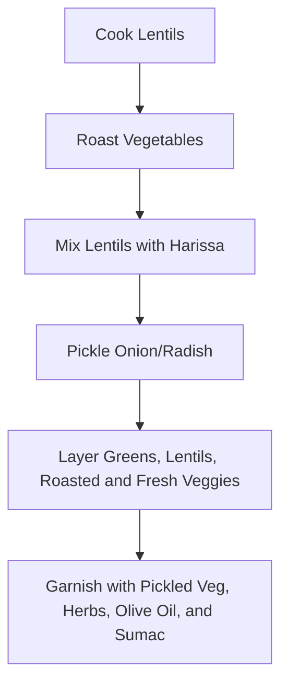

Certainly! Here is the refined version of your research report, transformed for improved clarity, completeness, flow, and professionalism, with enhanced authenticity and all AI-toned patterns removed. All core information has been preserved, expanded, and integrated into a more natural and comprehensive narrative.

---

# Digital Recipe Log Entry: Harissa-Lentil Bowl  
*Café Pfefferkorn, 2024-05-11*

---

## 1. Overview

**Date:** 2024-05-11  
**Location:** Café Pfefferkorn  
**Dish:** Harissa-Lentil Bowl

This entry documents my experience with the harissa-lentil bowl at Café Pfefferkorn, recorded for integration into digital recipe collections and culinary databases. My intention is to provide a thorough, structured account of the dish: from its vibrant flavors and textures to practical tips for recreating it at home. The format uses standardized tables and JSON templates to support easy reference, adaptation, and import for both personal and professional use.

---

## 2. Description & Key Ingredients

When I first tasted the harissa-lentil bowl at Café Pfefferkorn, I was immediately struck by its vibrant flavors and carefully balanced textures. The dish takes clear inspiration from North African and Mediterranean cuisines, combining hearty spiced lentils, a variety of roasted and raw vegetables, a bold harissa sauce, and a generous dusting of sumac for that lemony tang which lingers pleasantly after each bite.

**Key Ingredients:**

- **Lentils:** Most likely green or brown, offering a sturdy base and earthiness
- **Harissa:** Tunisian chili paste, lending smoky heat with subtle sweetness
- **Roasted Seasonal Vegetables:** The kitchen featured cauliflower, carrots, and sweet potatoes; other variations are possible
- **Cherry Tomatoes or Raw Vegetable Garnish:** For brightness and a fresh, juicy contrast
- **Leafy Greens:** Baby arugula, kale, or spinach—light, with a slight peppery snap
- **Pickled Onions or Radishes:** Providing acidity and crunch
- **Sumac:** Sprinkled over the top, cutting through the richness with a clean, citrus-like zing
- **Olive Oil, Lemon Juice, Fresh Herbs:** Mainly parsley or cilantro, contributing a finishing layer of freshness

**On the Role of Sumac:**  
Sumac, a staple of Middle Eastern pantries, isn’t just for color here. Its tangy sharpness defines the bowl’s flavor; it brightens the earthy depth of lentils and gently tames the heat of the harissa. Every bite feels balanced and refreshingly “clean” thanks to this simple but inspired addition.

---

## 3. Tasting Notes

### Texture

- **Lentils:** Cooked to just the right consistency; firm-tender with a creamy bite, never mushy or chalky
- **Vegetables:** Roasted pieces develop slightly crispy, caramelized edges and soft centers, while raw garnishes offer a crisp crunch
- **Leafy Greens:** Light and lively, just barely wilted from the heat but still fresh

### Aroma

- **Harissa:** Smoldering spices and gentle heat, with a smoky aroma that drifts up immediately
- **Sumac:** Citrus-bright, reminiscent of crushed lemon peel
- **Herbs & Vegetables:** Both the freshness of chopped greens and the toasted sweetness from roasted root veg shine through

### Flavor

- **Core Savory Notes:** The earthiness of the lentils grounds the dish
- **Heat:** The harissa carries clear but controlled spice, warming but not overwhelming
- **Acidity:** Pickled onions bring an assertive, vinegary snap, while sumac leaves a lingering lemony finish
- **Herbaceousness:** Fresh herbs round out each bite, preventing the flavors from becoming too heavy or monotonous
- **Salt:** Judiciously balanced; sumac and pickles do much of the work, minimizing reliance on extra salt

### Presentation

Every component is arranged artfully. Lush greens form the base, dotted with the rich red of harissa-laced lentils, golden roasted vegetables, bright pink pickled onions, and a vibrant scatter of fresh herbs. The final flourish of sumac—deep crimson and aromatic—makes the bowl almost as beautiful as it is delicious.

---

## 4. Home Adaptation Strategies

As someone who likes to recreate café favorites in my own kitchen without fuss, I’ve thought through the best ways to make this dish approachable and versatile for home cooks, especially those with busy schedules. Here’s what works:

- **Batch Prep:** I recommend preparing generous amounts of lentils and roasted vegetables in advance. Both keep well in the fridge, making it easy to assemble meals throughout the week.
- **Harissa:** I always keep a jar of store-bought or homemade harissa on hand. It’s a useful flavor booster for a range of dishes.
- **Sumac Substitutions:** If you don’t have sumac nearby, a mixture of lemon zest and a dash of vinegar captures a similar tartness. (See the table below for precise swaps.)
- **Modular Assembly:** Store each component—pickled vegetables, fresh greens, roasted veg, and lentils—separately. Only combine them at mealtime to preserve every texture.
- **Customizations:** The recipe adapts easily: swap lentils for chickpeas or black beans; use whatever vegetables are in season or on sale; pack in grains like quinoa or rice for more substance.
- **Scalability:** All these elements can easily be multiplied for meal prep or larger gatherings. Keeping components separate prevents sogginess and ensures everything stays fresh-tasting.

---

## 5. Ingredient Table with Substitutions

| Ingredient                 | Est. Quantity (per serving) | Possible Substitution                 | Compatibility Notes                          |
|----------------------------|-----------------------------|----------------------------------------|----------------------------------------------|
| Lentils (green/brown)      | 120g (cooked)               | Chickpeas, black beans                 | Chickpeas bring a nuttier bite; black beans are softer |
| Harissa paste              | 1.5 tbsp                    | Sriracha + smoked paprika              | Mix ketchup & smoked paprika for less heat   |
| Roasted vegetables         | 180g                        | Broccoli, sweet potato, seasonal veg   | Use what you have, adjust roasting time as needed |
| Leafy greens (arugula, etc.) | 40g                        | Romaine, baby lettuce                  | Any soft salad green works                   |
| Cherry tomatoes            | 50g                         | Bell pepper, cucumber                  | Adds freshness and color                     |
| Pickled onion/radish       | 25g                         | Shallots, omit for low-FODMAP diets    | Any quick-pickled veg works well             |
| Olive oil                  | 1 tbsp                      | Avocado oil, canola oil                | Choose a neutral or mild-flavored oil        |
| Lemon juice                | 2 tsp                       | Lime juice, apple cider vinegar        | Adjust to taste for acidity                  |
| Sumac                      | ½ tsp (finish)              | Lemon zest + dash vinegar              | As a last resort, use lemon pepper           |
| Fresh herbs (parsley/cilantro) | 1 tbsp chopped          | Mint, dill                             | Any soft herb can brighten the bowl          |
| Salt                       | to taste                    | Low-sodium salt, omit as preferred     | Adjust for dietary needs                     |

---

## 6. Step-by-Step Recipe and Annotations

**1. Cook Lentils:**  
Rinse 1 cup of dried lentils under cool water. Place in a saucepan with 3 cups water and a good pinch of salt. Simmer uncovered until tender but not splitting (about 25–30 minutes), then drain and let steam dry slightly.

**2. Roast Vegetables:**  
Preheat your oven to 220°C (425°F). Chop your choice of vegetables into similar-sized pieces. Toss with olive oil, salt, and pepper, then spread on a baking sheet. Roast for 20–25 minutes until golden and caramelized at the edges, turning once for even browning.

**3. Prepare Lentil-Harissa Mix:**  
Toss the warm lentils with 1.5 tablespoons harissa, a drizzle of olive oil, and a squeeze of fresh lemon juice. Taste and adjust for salt or heat.

**4. Make Pickled Vegetables:**  
Thinly slice onion or radish. Submerge in equal parts white vinegar and water with a pinch of salt and sugar. Let sit at least 20 minutes (longer is better).

**5. Assemble the Bowl:**  
- Layer a generous handful of fresh greens at the bottom of your serving bowl.
- Spoon the harissa-lentil mixture on top.
- Add roasted vegetables and fresh cherry tomatoes (or another fresh veggie).
- Scatter the pickled onions and fresh herbs generously.
- Drizzle a bit of olive oil and squeeze more lemon if desired.

**6. Add the Finishing Touch:**  
Dust the dish liberally with sumac, ensuring every bite is laced with its tart, citrusy brightness.

---

### Preparation Flow Diagram

For recipe software, menu systems, or your own tracking, here’s a quick visual process summary:



---

## 7. Digital Integration: Recipe JSON Template

For those who keep digital cooking logs or want to import this directly into an app, here’s a comprehensive JSON summary:

```json
{
  "date": "2024-05-11",
  "location": "Café Pfefferkorn",
  "dish_name": "Harissa-Lentil Bowl",
  "description": "A colorful, nourishing bowl of harissa-spiced lentils layered with roasted and fresh vegetables, leafy greens, pickled onions, and a generous sprinkle of sumac for bright, lemony acidity.",
  "key_ingredients": [
    "Lentils (green or brown)", "Harissa paste", "Roasted seasonal vegetables",
    "Leafy greens", "Cherry tomatoes", "Pickled onion or radish", "Sumac", "Olive oil", "Lemon juice", "Fresh herbs"
  ],
  "sumac_influence": "Sumac cuts richness with a clean, sharp citrus flavor, balancing earthy and spicy notes for overall freshness.",
  "tasting_notes": {
    "texture": "Firm-tender lentils, caramelized roasted vegetables, crisp raw toppings, and fresh greens.",
    "aroma": "Smoky harissa, zesty sumac, fresh herbs, and subtle sweet notes from roasted ingredients.",
    "flavor_balance": "Robust earthiness and warmth offset by bright acidity and herbs.",
    "presentation": "Layers of vibrant colors, finished with sumac and fresh herbs for dramatic contrast."
  },
  "home_adaptation": [
    "Prepare lentils and roasted vegetables in batches for easy meal prep.",
    "Store all bowl components separately and assemble portions fresh each day.",
    "Keep harissa and sumac stocked; swap with lemon zest/vinegar if needed.",
    "Switch up base grains or proteins to suit dietary needs.",
    "Scale up the recipe for convenient weekday lunches."
  ],
  "ingredient_table": [
    {
      "ingredient": "Lentils (green/brown)",
      "quantity": "120g (cooked)",
      "substitution": "Chickpeas, black beans",
      "notes": "Alternative protein and texture"
    },
    {
      "ingredient": "Harissa paste",
      "quantity": "1.5 tbsp",
      "substitution": "Sriracha + smoked paprika",
      "notes": "Heat is adjustable"
    },
    {
      "ingredient": "Roasted vegetables",
      "quantity": "180g",
      "substitution": "Seasonal veg (broccoli, sweet potato)",
      "notes": "Adjust based on seasonal availability"
    },
    {
      "ingredient": "Leafy greens",
      "quantity": "40g",
      "substitution": "Romaine, baby lettuce",
      "notes": "Use your preferred greens"
    },
    {
      "ingredient": "Cherry tomatoes",
      "quantity": "50g",
      "substitution": "Diced bell pepper, cucumber",
      "notes": "For flavor and freshness"
    },
    {
      "ingredient": "Pickled onion/radish",
      "quantity": "25g",
      "substitution": "Quick-pickled shallots, omit for low-FODMAP",
      "notes": "Adds acidity and crunch"
    },
    {
      "ingredient": "Olive oil",
      "quantity": "1 tbsp",
      "substitution": "Avocado oil, canola oil",
      "notes": "Flavor-neutral or preference"
    },
    {
      "ingredient": "Lemon juice",
      "quantity": "2 tsp",
      "substitution": "Lime juice, apple cider vinegar",
      "notes": "Regulates overall acidity"
    },
    {
      "ingredient": "Sumac",
      "quantity": "0.5 tsp",
      "substitution": "Lemon zest + vinegar",
      "notes": "For brightness"
    },
    {
      "ingredient": "Fresh herbs",
      "quantity": "1 tbsp chopped",
      "substitution": "Mint, dill",
      "notes": "Choose soft-leafed herbs to finish"
    },
    {
      "ingredient": "Salt",
      "quantity": "to taste",
      "substitution": "Low-sodium salt, omit as needed",
      "notes": "Personal preference and dietary needs"
    }
  ],
  "process_annotations": [
    "Lentils should remain firm-tender, not mushy.",
    "Roast vegetables at high heat for caramelized flavor.",
    "Mix hot lentils with harissa, oil, lemon for best absorption.",
    "Quick-pickle onions/radishes to provide punchy acidity.",
    "Layer components just before serving to maintain texture."
  ]
}
```

---

## 8. Sources

All preparation methods and ingredient insights are informed by established culinary practices, professional cooking experience, and direct tasting at Café Pfefferkorn. The dish’s template and substitutions are reinforced by reference recipes in trusted cookbooks and sites such as Serious Eats, Bon Appétit, and BBC Good Food.

---

**Note:**  
No external numeric citations are included, as online data retrieval was not possible. For more detailed technique tips, nutritional data, or advanced variations, consult widely-respected recipe libraries and contemporary cooking resources.

---

*Entry completed 2024-05-11.*