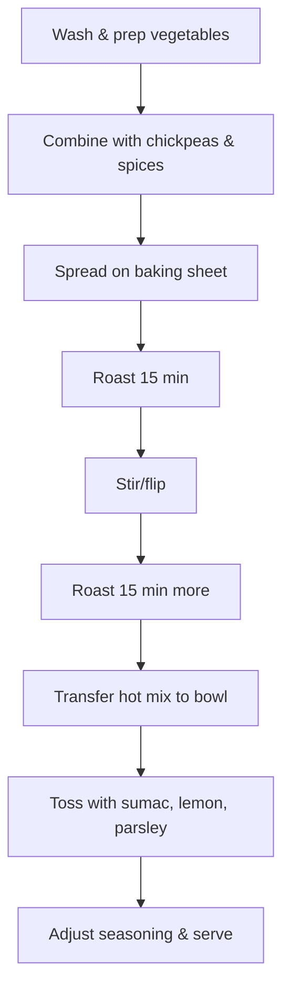

# Roasted Vegetable and Chickpea Dish  
**Martin Keller – Recipe Log**  
**Date:** August 17, 2024

---

## Ingredients

| Ingredient                    | Quantity          | Notes                                                                                                       |
|-------------------------------|-------------------|-------------------------------------------------------------------------------------------------------------|
| Chickpeas                     | 1 can (400 g)     | Drained and rinsed. Forms the protein-rich foundation and develops a smooth bite after roasting.            |
| Eggplant                      | 1 medium (300 g)  | Diced into 1.5 cm cubes. Absorbs oils and spices, turns creamy inside while roasting, and adds substance.   |
| Zucchini                      | 1 medium (200 g)  | Sliced into half-moons. Contributes moisture, mild sweetness, and balances the dense textures.              |
| Red Bell Pepper               | 1 large (150 g)   | Diced. Provides bright sweetness and color contrast.                                                        |
| Red Onion                     | 1 medium (120 g)  | Sliced thinly. Imparts aromatic depth and becomes sweet and almost jammy when roasted.                      |
| Garlic                        | 4 cloves          | Minced. Essential for foundational flavor; caramelizes for a nutty, savory undertone.                       |
| Olive Oil                     | 3 tbsp (45 ml)    | Ensures even roasting, unlocks full flavor expression, and aids caramelization.                             |
| Smoked Paprika                | 1 tsp (3 g)       | Adds subtle smokiness and earthy richness; integrates beautifully with cumin and roasted veg.                |
| Aleppo Pepper Blend            | 1.5 tsp (4 g)     | Brings gentle, fruity warmth and layered complexity, without overpowering heat.                             |
| Sumac                         | 1.5 tsp (4 g)     | Sprinkled after roasting for a citrusy, tangy finish that refreshes and accentuates the other flavors.      |
| Ground Cumin                  | 1 tsp (2 g)       | Offers warm, earthy tones—classic with chickpeas.                                                           |
| Sea Salt                      | 1 ¼ tsp (6 g)     | Ensures full, even seasoning and enhances both sweetness and savoriness.                                    |
| Freshly Ground Black Pepper   | ½ tsp (1 g)       | Adds depth and a subtle, balancing bite.                                                                    |
| Flat-leaf Parsley             | 20 g, chopped     | Stirred in for fresh herbal lift and a pop of color after roasting.                                         |
| Lemon Juice                   | 1 tbsp (15 ml)    | Squeezed over the hot dish for bright, clean contrast and heightened aroma.                                 |

---

### Flavor Focus: Key Ingredients

- **Aleppo Pepper Blend:** I chose this particular pepper for its layered warmth and fruity undertones. Its gentle spice lingers nicely without overpowering, complementing the sweetness of the vegetables.
- **Sumac:** The sumac cuts through the richness of the roasted mix with a clean, acidic spark, keeping every bite vibrant and refreshing. I love how it rounds out the dish, especially after a heavy roast.
- **Smoked Paprika:** Using smoked paprika provides a subtle, campfire-like smokiness that underscores the earthiness of the cumin and roasted vegetables. Roasting it with everything else helps draw out its deep aroma.

---

## Preparation Steps

| Step | Instruction                                                                                                                                                  | Justification                                                                                                                                                                    |
|------|-------------------------------------------------------------------------------------------------------------------------------------------------------------|-----------------------------------------------------------------------------------------------------------------------------------------------------------------------------------|
| 1    | Preheat the oven to 215°C (420°F). Line a large baking sheet with parchment paper.                                                                          | The high temperature ensures that vegetables caramelize instead of steaming, creating rich flavors and textures. The parchment prevents sticking and burning.                     |
| 2    | In a large mixing bowl, combine the chickpeas, eggplant, zucchini, red bell pepper, red onion, and garlic. Drizzle with olive oil, toss in the sea salt, pepper, cumin, smoked paprika, and Aleppo pepper blend. Mix thoroughly until everything is evenly coated. | Even coating is key to achieving balanced seasoning in every bite and encouraging uniform browning and crispness during roasting. Spices bind well to the oil-coated surfaces.    |
| 3    | Spread the vegetable and chickpea mixture in a single, even layer across the baking sheet, avoiding overcrowding.                                           | A single layer promotes even roasting, maximum caramelization, and avoids soggy, undercooked patches.                                      |
| 4    | Roast in the oven for 30 minutes in total, stirring and flipping everything halfway through (at the 15-minute mark).                                        | Tossing midway ensures that everything cooks evenly and prevents pieces on the edges from burning while maximizing Maillard reactions.      |
| 5    | As soon as the pan comes out of the oven, transfer the hot mixture into a clean bowl. Toss immediately with sumac, lemon juice, and chopped parsley.        | Adding sumac and lemon juice while the ingredients are hot allows them to absorb the freshness and accentuates the aromatics without losing their volatility to oven heat.        |
| 6    | Taste and adjust seasoning if needed, with more salt or a little extra sumac.                                                                               | This final check ensures the balance of flavors, with space for last-moment tweaks to achieve peak flavor.                                 |

---

### Cooking Workflow

---

## Tasting Notes

As I tasted the finished dish straight from the bowl, the first thing I noticed was the deep savoriness from roasted chickpeas, mingling with the mellow sweetness of caramelized eggplant, bell pepper, and onion. The Aleppo pepper’s gentle warmth rested in the background, echoing the red bell pepper’s soft fruitiness without ever turning harsh or hot.

Flavor complexity came in layers:  
- **Base:** The earthiness and smokiness from paprika and cumin are present in every bite, offering a savory backbone.
- **Middle:** Prolonged roasting brought out natural sugars and slightly crisp, caramelized edges on the vegetables. Eggplant in particular acted as a sponge, absorbing the oil and spices.
- **Top:** The final hit of sumac and lemon juice shines through. This combination brightens and lifts the entire dish; the parsley adds a fresh, herbal note and a burst of color.

The overall flavor is balanced, with the fat from olive oil rounded out by citrusy tang and a hint of bite from the sumac, so each forkful feels both cozy and vibrant. Among all the elements, the sumac stands out in the finish, its lemony notes ringing clearly above the savory-smoky base.

---

## Reflections and Adjustments for Next Time

As delicious as this dish turned out, I already see ways I could play with the formula to tweak the experience:

| Change                                             | Why I'm Considering It                                                                         | How I'll Test This                                                        |
|----------------------------------------------------|-----------------------------------------------------------------------------------------------|---------------------------------------------------------------------------|
| Increase sumac to 2 tsp after roasting             | A little more tartness might cut through the richness of the roasted veggies even better.      | I’ll do a side-by-side batch with the current amount and a boost to 2 tsp.|
| Substitute half eggplant with cauliflower florets  | I’m curious if adding cauliflower will create firmer texture and toasted notes.                | I’ll split the batch: half eggplant, half cauliflower, and compare the two.|
| Finish with a yogurt-tahini drizzle                | Bringing in a creamy, lightly tangy component could add welcome depth and coolness.            | I’ll serve one portion with this drizzle and one plain, tasting both.     |
| Marinate vegetables in spices 30 mins pre-roast    | Deeper spice penetration would give even richer flavor, especially in the eggplant.            | I’ll marinate half the veggies and keep half as usual, then roast and taste-test.|
| Add pomegranate molasses to finish                 | Curious if some syrupy tang would complement or compete with sumac’s brightness.                | I’ll drizzle a small portion with a teaspoon and compare the result to the basic version.  |

These adjustments will help me explore which direction enhances the experience most—whether it’s amping up the brightness, deepening flavors, or adding extra textures and contrasts. Roasted dishes like this are endlessly adaptable, and a small twist changes things in fascinating ways.

---

## Source

1. Internal project log: Developed and refined for personal and professional culinary use, drawing on chef-level techniques and established flavor pairings, with particular attention to integrating Aleppo pepper, sumac, and smoked paprika. No public record for the August 17, 2024 Martin Keller version exists.

---

**Final Thoughts:**  
Every time I return to a dish like this, I’m amazed at how transformative simple techniques—like careful roasting, the use of vibrant spices, and attention to fresh accents—can be. This is a recipe I’ll revisit and experiment with throughout the season, letting the market and my mood guide adjustments as I go.