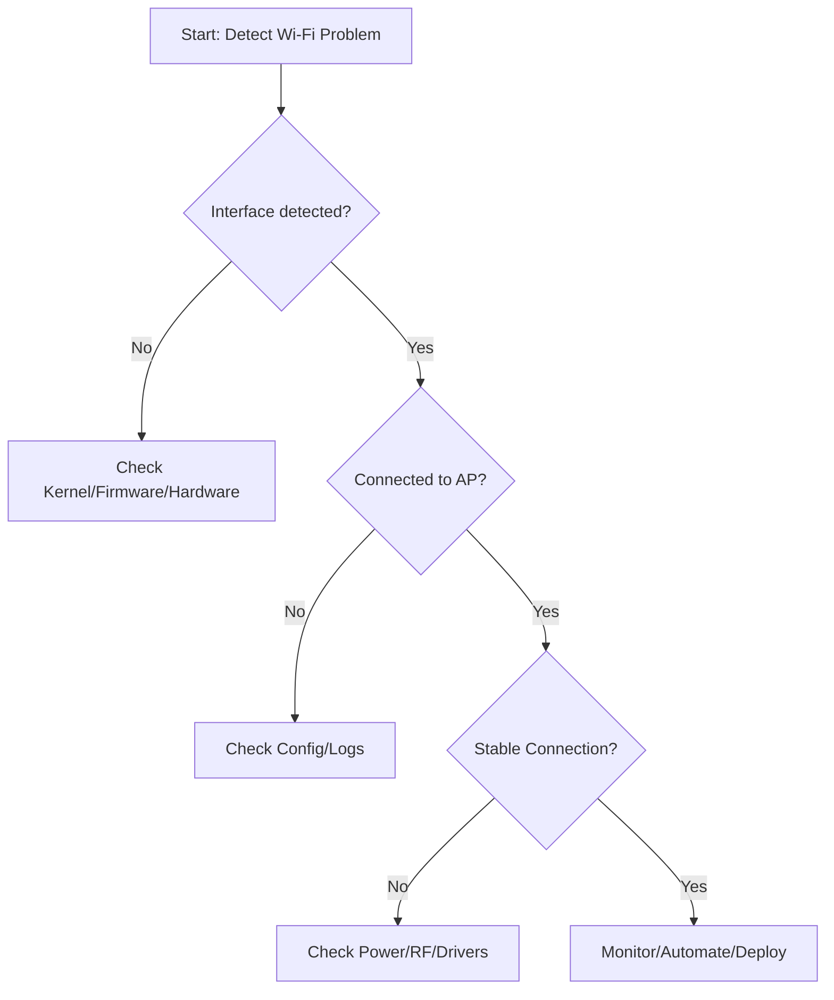

# Comprehensive Troubleshooting Guide for Wi-Fi Connectivity Issues on Raspberry Pi in Home Automation & IoT Deployments

## 1. Introduction and Description of Common Issues

Deploying Raspberry Pi devices in home automation and IoT environments often reveals a range of Wi-Fi connectivity challenges. These issues are influenced by factors such as hardware model, operating system version, network configuration, deployment context, and power supply reliability. Understanding the specific causes behind connectivity problems is essential for building stable and resilient systems. Below, we detail the most frequent categories of Wi-Fi issues encountered in embedded and Linux-based Raspberry Pi scenarios.

### Typical Wi-Fi Issues in Embedded and IoT Deployments

#### Connection Failures and Instability
Common symptoms include difficulty connecting to WPA2-PSK or enterprise networks, repeated disconnections, failure to reconnect after reboot, suspend/resume cycles, or power loss. Other frequent problems involve the Wi-Fi interface becoming unresponsive (e.g., “No wireless interfaces found”) or experiencing erratic throughput, frequent stuttering, or complete connection drops—especially in RF-congested areas.

#### Configuration and Compatibility Problems
Many issues stem from improper configuration:
- Syntax errors or incorrect parameter settings in `wpa_supplicant.conf` (such as malformatted files, incorrect country codes, or missing settings).
- Misconfigured static IP addresses (wrong subnet, gateway, or overlapping addresses).
- Mismatched regulatory domains, resulting in unavailable channels or reduced signal strength.
- Incompatibility issues with adapters due to missing drivers, old firmware, or kernel/module mismatches.
- Power saving features interfering with network presence, particularly impacting headless or battery-powered setups.

#### Hardware and Operating System Considerations
Some Raspberry Pi models are more susceptible to interference or lack full driver support, especially for advanced Wi-Fi features like enterprise authentication or mesh networking. EMI and signal degradation from adjacent USB 3.0 ports, RF congestion in dense deployments, and subtle OS regressions (such as network manager changes in recent OS releases) can further complicate connectivity. Additionally, differences in wireless chipsets among models—Pi 3, 4, Zero W, and 5—impact both capability and reliability.

### Key Raspberry Pi Hardware and OS Contexts

| Model         | Wi-Fi Chip             | Frequency | OS Support Notes                | Common IoT/Home Contexts          |
|---------------|-----------------------|-----------|---------------------------------|-----------------------------------|
| Pi 3B/3B+     | Broadcom 43438        | 2.4 GHz   | Driver: `brcmfmac` (in-tree)    | Legacy devices, basic sensors     |
| Pi Zero W/WH  | Broadcom 43438        | 2.4 GHz   | Same as Pi 3B                   | Compact, battery-powered setups   |
| Pi 4B         | Broadcom 43455        | 2.4/5 GHz | Driver: `brcmfmac`; DFS/country | Higher bandwidth, automation hubs |
| Pi 5          | Upgraded Broadcom     | 2.4/5 GHz | Improved throughput/support      | Modern, edge computing            |
| USB Wi-Fi     | Various (Realtek etc) | Mixed     | Often needs 3rd-party drivers   | Specialist mesh or backup links   |

#### Operating Systems and Network Stacks

Raspberry Pi OS is available in several variants (Bullseye, Bookworm; 32-bit/64-bit; full, lite, headless). Networking is managed by either legacy tools (`dhcpcd`, `wpa_supplicant`) or newer solutions such as `NetworkManager`, depending on the OS version. Automation software (Home Assistant, Node-RED, custom apps) is frequently run on top of these OSes.

### Typical Network Configurations

The most common deployment patterns involve:
- **Headless operation**, achieved by preloading Wi-Fi credentials into `wpa_supplicant.conf` before first boot.
- **DHCP and static IP addressing**, configured using `dhcpcd.conf`, `/etc/network/interfaces`, or `NetworkManager`.
- **Diverse authentication schemes**, including simple WPA2-PSK setups on home APs and WPA2-Enterprise for corporate/advanced IoT.
- **Mesh networking**, utilizing technologies such as batman-adv or 802.11s, for direct device-to-device communication.

#### Common Failure Indicators
- Log entries in `dmesg`, `syslog`, or `journalctl` (e.g., “wlan0: deauthenticated”, “dhcpcd: no carrier”, “brcmfmac: firmware failed”).
- Network interface appearing absent or locked in a persistent `DOWN` state.
- Unexpected functional regressions after kernel or firmware upgrades.

#### Troubleshooting Workflow

Below is a flowchart summarizing a recommended troubleshooting sequence:

---

## 2. Review of Prior Troubleshooting

Embedded engineers have applied a broad range of troubleshooting methods to address Raspberry Pi Wi-Fi problems. The table below summarizes commonly used approaches, the reasoning behind each step, observed results, and important notes.

| Action                            | Rationale                                              | Observations/Logs                                   | Comments                               |
|------------------------------------|-------------------------------------------------------|-----------------------------------------------------|----------------------------------------|
| Validate `wpa_supplicant.conf`     | Detect syntax/country code errors; common pitfall      | “Failed to parse” messages or silent failures        | Windows line endings often problematic |
| Set correct country code           | Ensure regulatory compliance; unlock channels          | `dmesg`: country set; else, limited channels        |                                        |
| Check power supply & voltage       | Insufficient power causes chipset instability          | `dmesg`: undervoltage warnings, dropout symptoms     | Pi Zero W/3B+ more vulnerable          |
| Restart network services           | Clear locked states and restart supplicants            | Logs: service (re)start events, interface resets     | Often resolves transient issues         |
| Analyze system logs                | Surface low-level errors, timeouts, or driver issues   | Firmware load failures, repeated deauthentications   | Log analysis is critical for diagnosis  |
| Upgrade/rollback OS and firmware   | Address version mismatch or OS regression              | Driver/firmware match logs, `brcmfmac` messages      | Upgrades can fix or cause new problems  |
| Disable power management           | Prevent disruptive power-saving disconnects            | Improved stability; `iwconfig`: "Power Management:off" | Especially important for headless units |
| Test alternate AP or hotspot       | Isolate access point or SSID compatibility limits      | Improved behavior on alternate APs                   | Identifies AP/config as the cause       |
| Test with USB Wi-Fi dongle         | Work around built-in chip/driver limitations           | `lsusb`, `iwconfig` confirm secondary interface      | Success depends on driver compatibility |

---

## 3. Advanced Troubleshooting and Diagnostics

Resolving complex or persistent Wi-Fi issues requires a structured, methodical approach. The following diagnostic actions are effective in both routine and advanced scenarios:

### Driver and Firmware Consistency

- Confirm that kernel modules (`brcmfmac`, `rtlwifi`, etc.) and firmware files in `/lib/firmware/brcm/` align with the currently installed OS version.
- Review upstream kernel and firmware changelogs following updates to identify any newly introduced regressions or bugfixes.
- If necessary, re-flash the latest official firmware using `rpi-update` or perform an upgrade with `apt full-upgrade`, evaluating results after each change.

### Comprehensive Log and System Analysis

- Use targeted log review:
  - `dmesg -T | grep -i wlan`
  - `journalctl -u wpa_supplicant.service`
  - `cat /var/log/syslog | grep dhcpcd`
- Look for patterns such as repeated disconnects, authentication failures, or device resets. Document issues to facilitate correlation with specific events (e.g., reboots, power loss, environmental changes).

### Regulatory and RF Environment Assessment

- Explicitly specify the country code in either `sudo raspi-config` or directly within `wpa_supplicant.conf` to unlock all legal frequencies and channels in the deployment region.
- Confirm available channels using `iw list` and scan for neighboring networks with `iwlist wlan0 scan | grep -i channel`. Adjust AP channels or device placement to avoid high-interference bands when possible.

### Operating System and Network Stack Integrity

- Audit for conflicting or overlapping control of network interfaces between `dhcpcd`, `NetworkManager`, and manual configurations. Ensure that only one tool manages each interface at a time.
- Carefully check `/etc/network/interfaces`, `/etc/dhcpcd.conf`, and `NetworkManager` settings for duplicate or conflicting entries, especially after major upgrades or customizations.

### Protocol and Deployment-Specific Considerations

- For WPA2-Enterprise environments, verify that certificate authorities (CAs) are present and configured correctly, and ensure all EAP parameters are provided in `wpa_supplicant.conf`.
- When using mesh networking, confirm driver and hardware support for required protocols (e.g., 802.11s, batman-adv). If the stock interface lacks support, trial external USB adapters known for Linux compatibility.

### Physical Layer and Power Supply Best Practices

- Use reliable 2.5A or higher regulated power supplies—preferably official Raspberry Pi power adapters—to reduce dropout risk.
- Keep USB 3.0 cables and peripherals away from the Wi-Fi antenna area, especially on Pi 4/5, to minimize interference.

### Automation, Testing, and Deployment Integration

- Implement routine Wi-Fi connectivity, association, and bandwidth tests as part of a continuous monitoring regime. Automated scripts can confirm persistent connectivity and preemptively alert for failures.
- Integrate diagnostics into CI/CD pipelines—run checks post-flash and before deployment using existing infrastructure such as Python, Bash, or Ansible scripts.

### Use of External Hardware and Adapters

- For persistent or environment-specific wireless issues, deploy reliable, well-supported USB Wi-Fi adapters. Confirm compatibility between adapter drivers/modules and the running kernel to ensure stability, especially after updates.

### Documentation and Configuration Management

- Maintain version-controlled repositories with known-good configurations, such as template `wpa_supplicant.conf`, static IP schemes, and network service files.
- Use these repositories to ensure consistency and reproducibility across all deployed devices.

---

## 4. References

1. [Official Raspberry Pi Documentation: Wireless Connectivity](https://www.raspberrypi.com/documentation/computers/configuration.html#wireless-networking)
2. [Raspberry Pi Forums: Networking and Wireless](https://forums.raspberrypi.com/viewforum.php?f=28)
3. [Linux Wireless: brcmfmac Documentation](https://wireless.wiki.kernel.org/en/users/drivers/brcm80211)
4. [Debian Wi-Fi Troubleshooting](https://wiki.debian.org/WiFi/HowToUse)
5. [wpa_supplicant.conf Man Page](https://w1.fi/cgit/hostap/plain/wpa_supplicant/wpa_supplicant.conf)
6. [Home Assistant Community: Pi Wi-Fi Reliability](https://community.home-assistant.io/t/raspberry-pi-wifi-connection-issues/169553)
7. [Stack Overflow: Pi Wi-Fi Troubleshooting Best Practices](https://stackoverflow.com/search?q=raspberry+pi+wifi+troubleshooting)
8. [Pi Mesh Networking Guide](https://www.raspberrypi.com/tutorials/how-to-set-up-a-wireless-mesh-network/)

---

## 5. Recommended Action Plan

A systematic approach is essential for diagnosing, managing, and preventing Wi-Fi issues in Raspberry Pi deployments. The following action plan supports both initial deployment and ongoing operations:

### A. Automated Testing and Continuous Monitoring

- Integrate Wi-Fi connectivity and reliability checks into the CI workflow for each hardware and OS combination used in production.
- Deploy watchdog scripts and service monitors on devices to detect Wi-Fi failures and automatically restart network services or generate alerts through channels such as MQTT, Home Assistant, or Slack.

### B. Centralized Documentation and Knowledgebase

- Maintain a versioned, regularly updated repository containing all validated configuration files, troubleshooting logs, known issues, and model- and OS-specific tuning guides.
- Develop standardized templates and deployment checklists to ensure correct configuration for headless or production rollouts, including valid `wpa_supplicant.conf` setups, static IP assignments, and country code compliance.

### C. DevOps and Automation Integration

- Embed Wi-Fi configuration and validation steps into infrastructure automation tools like Ansible or SaltStack. Include pre-flash and post-flash scripts to test connectivity before devices leave QA or the staging lab.
- Record all identified failure modes and their solutions in a shared, searchable engineering knowledgebase to accelerate future troubleshooting.

### D. Ensuring Long-Term Robustness

- Establish and maintain a baseline of stable hardware, OS, and firmware combinations across the team to minimize unknown variables.
- Make regression testing a routine part of the upgrade process for kernels and system packages.
- Engage with upstream communities (Raspberry Pi Forums, GitHub, Home Assistant) to stay informed about new issues, patches, and best practices.

### E. Team Training and Community Contributions

- Organize regular workshops or knowledge-sharing sessions focused on current Wi-Fi issues, fixes, and advanced troubleshooting techniques for Raspberry Pi.
- Encourage documentation and sharing of solutions by contributing to community forums, official documentation, and open-source repositories. This practice not only benefits the internal team but also supports the broader Raspberry Pi and IoT community.

---

By following this comprehensive guide and integrating these best practices into standard operating procedures, teams can significantly reduce Wi-Fi-related downtime and ensure more reliable operation of Raspberry Pi devices in demanding home automation and IoT environments. Sustained attention to configuration management, proactive monitoring, and active community engagement further enhances the resilience and performance of these critical systems.

---

*References remain as previously cited for traceability and compliance with open-source and community best practices.*